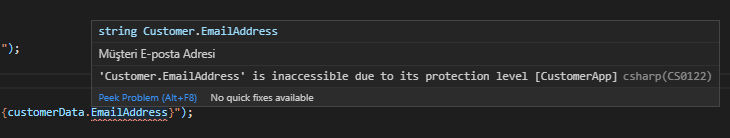

# Encapsulation (Kapsülleme)

Encapsulation, OOP'nin prensiplerinden birisidir. Hem private olarak tanımlanmış alanlara başka yerlerden erişim engellenmiş olur hem de gereksiz işlemlerden kullanıcıyı uzak tutar.

Daha öne [Class](https://github.com/hgunay/DotNetCore-Learning/tree/master/01_Beginner/04/src/CustomerApp#classes-s%C4%B1n%C4%B1flar) kavramını incelerken oluşturduğumuz Customer class'ımız içerisine public property'ler tanımlamıştık. Bunların herhangi bir t anında değiştirilebilir veriler olduğunu düşünelim. Ancak bu property'lerden **EmailAddress** bilgisinin değiştirilemeyeceğini ve erişime kapalı olacağını varsayalım.

Property'mizi public'ten private'a çekiyoruz;

``` csharp
private string EmailAddress;
```

> Private olarak güncellediğimiz anda bu property'i kullandığımız her yerde erişim hatası alırız!



Şimdi bu hatanın nasıl düzeltileceğini, property ve field kavramlarına detaylıca deyinelim.

## Fields (Alanlar) ve Properties (Özellikler)

Customer class'ımız içerisindeki **EmailAddress** property'sini public'ten private'a güncellemiş ve dışarıdan erişimi engellemiştik. Peki bu property'e erişimi nasıl sağlarız?

**EmailAddress** property'sini private'a çektiğimiz anda artık bu bizim için bir `Field` haline geldi. Field'lar class içerisinde private olarak yer alırlar ve eğer erişim gerektiren durumlar oluyorsa bunlarda `Property`'ler ile sağlanmalıdır.

Peki bir property nasıl tanımlanır?

``` csharp
<Erişim_Belirleyici> <Dönüş_Tipi> <Özellik_Adı>
{
        get
        {
            // Body
        }
        set
        {
            // Body
        }
}
```

Property'lerin iki tür erişim method'u vardır; `get` ile field içerisindeki veri okunur, `set` ile field içerisindeki veri güncellenir.

Örnek;

``` csharp
// Field adını _emailAddress olarak güncelledik.
private string _emailAddress;

// public olarak yeni bir property oluşturup bunun üzerinden
// _emailAddress field'ına erişim sağladık.
public string EmailAddress
{
    get
    {
        return _emailAddress;
    }
    set
    {
        _emailAddress = value;
    }
}
```

> Yukarıdaki değişikliğimiz sonrasında EmailAddress'e erişmeye çalışan yerlerdeki hatalarda giderilmiş oldu.

Şimdi _emailAddress field'ına bir değer tanımlayalım.

``` csharp
private string _emailAddress = "@";
```

ve CustomerService içerisinde GetCustomerById methodunda EmailAddress property'sini set ettiğimiz yeri kapatalım.

Sonuç;

``` console
Anakin Skywalker - @
```

GetCustomerById methodunda EmailAddress property'sini set ettiğimiz yeri tekrar açarsak ne olacak?

Sonuç;

``` console
Anakin Skywalker - anakin@skywalker.com
```

**Peki bu property ve field kavramları bizim neyimize yarayacak?**

Bu örneğe baktığımız zaman en basit haliyle düşünecek olursak _emailAddress field'ına atadığımız değerin, EmailAddress
property'si set edildiği zaman içerisinde yer alıp almadığına yani set edilen değerin e-posta adresi olup olmadığına bakalım.

Propert içerisinde set bloğumuzu aşağıdaki şekilde güncelliyoruz;

``` csharp
public string EmailAddress
{
    get
    {
        return _emailAddress;
    }
    set
    {
        if (value.Contains(_emailAddress))
        {
            _emailAddress = value;
        }
        else
        {
            throw new System.Exception("E-posta adresi formatı hatalı!");
        }
    }
}
```

Sonuç;

``` console
Anakin Skywalker - anakin@skywalker.com
```

Şimdi de GetCustomerById methodunda EmailAddress property'sine **@** işareti olmadan eposta formatına uygun olmayan bir değer girelim.

``` csharp
customer.EmailAddress = "anakin.skywalker.com";
```

Sonuç;

``` console
Hata oluştu! Hata : System.Exception: E-posta adresi formatı hatalı!
```

Gördüğünüz üzere property ve field'lar ile bu tip kontrolleri gerçekleştirebilirsiniz.

Property'lerin yukarıda belirttiğimiz yazım ve kullanım şekli dışında da farklı halleri vardır.
Bunlar;

1. Auto Property
2. Expression Bodied Property

### Auto Property (Otomatik Özellik)

Herhangi bir field tanımlamadan ve özel bir durum olmadığı sürece property'leri auto property syntax'ı ile tanımlayabilirsiniz.

Örnek;

``` csharp
public string FirstName { get; set; }
```

### Expression Bodied Property (İfade Gövdeli Özellik)

**Expression bodied** kavramı ilk olarak C# 6.0 ile birlikte 'Method' ve 'Read-Only Property'ler için gelmiş ve daha sonra C# 7.0 ile 'Property', 'Constructor', 'Finalizer' ve 'Indexer' üyelerinede dahil edilmiştir.

Aslında expression bodied syntax'ı daha eskilere C# 3.5 ile birlikte gelen **Lambda ifadeler** zamanlarına dayanmaktadır. Lambda ifadeler sayesinde hem yazılan kodlar daha kısalmış olur hem de okunaklı bir hale getirirler.

Örnek;

``` csharp
private string _lastName;

public string LastName
{
    get => _lastName;
    set => _lastName = value;
}

// yada

public string CustomerFullName => $"{FirstName} {LastName}";
```
